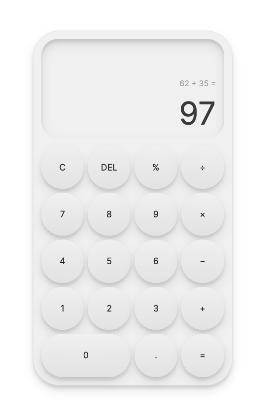

# Calculator App

Live preview: https://taewookim02.github.io/calculator/

This is a simple calculator app that allows users to perform basic mathematical operations such as addition, subtraction, multiplication, division, and modulo.

## How to use

To use the calculator, simply input numbers and select the desired operator using the buttons provided on the calculator. Press the = button to get the result of the operation. If you make a mistake or want to start a new calculation, use the AC button to clear all values. If you only want to clear the current value, use the C button.

You can also use the `DEL` button to delete the last character of the current value.

## Keyboard support

The calculator also supports keyboard input. You can use the numeric keys (0-9) to input numbers and the following keys to input operators:

- `0-9`: numbers
- `.`: decimal
- `+`: addition
- `-`: subtraction
- `*`: multiplication
- `/`: division
- `%`: modulo
- `=` or Enter: equals
- `Backspace`: delete

## Decimals

To input decimals, use the . button. Note that you can only input one decimal per number.

## Styling

The calculator app uses basic CSS styling to provide a clean and simple interface. The display container will automatically adjust its font size when a large number is inputted to ensure that the numbers are always visible.

## Limitations

The calculator app currently only supports basic mathematical operations and does not support more advanced operations such as square roots or exponential functions. It also does not handle division by zero and will display an error message in this case.
